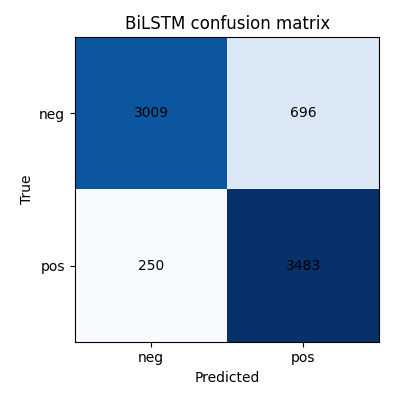
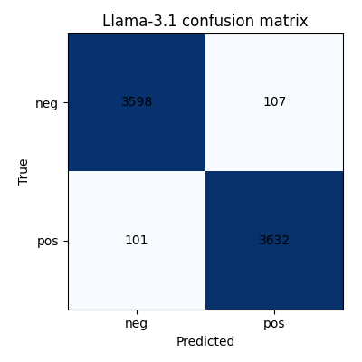
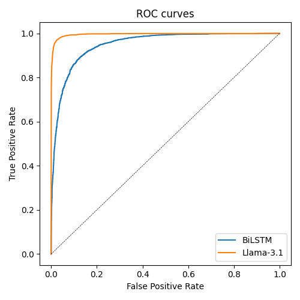
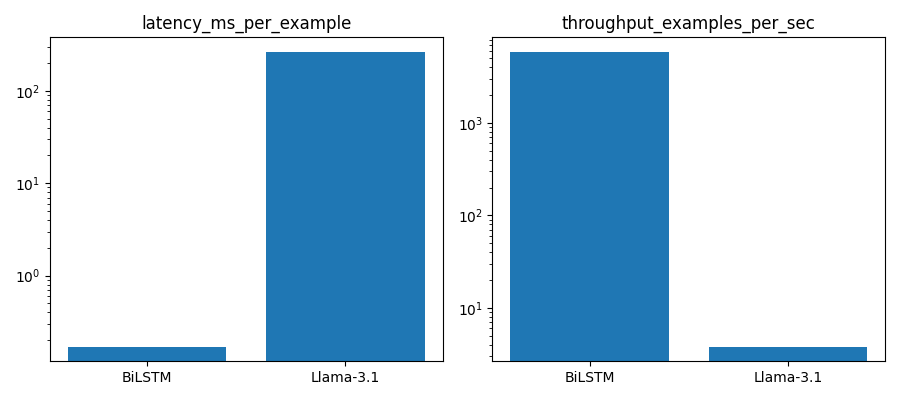

# IMDB Sentiment Analysis: BiLSTM vs Fine-Tuned Llama-3.1-8B-Instruct

A reproducible comparison between a classical **Bidirectional LSTM** and a
**QLoRA fine-tuned Meta Llama-3.1-8B-Instruct** (via plain Hugging Face
`transformers`/`peft`/`bitsandbytes`/`trl`) on binary sentiment classification
(IMDB movie reviews). See [`CLAUDE.md`](CLAUDE.md) for the full project spec
and engineering principles this repo follows (reproducibility, no data
leakage, identical evaluation protocol for both models).

## Setup

```bash
python3 -m venv .venv
./.venv/bin/pip install --upgrade pip
./.venv/bin/pip install -r requirements.txt
./.venv/bin/pip install -e .
```

`requirements.txt` pins `torch==2.13.0+cu129` via the `--extra-index-url` at
its top — **check this matches your GPU driver** (`nvidia-smi` shows the
driver's max supported CUDA version; the installed torch build must not
exceed it, e.g. a driver capped at CUDA 12.9 cannot run a CUDA-13 build). Two
pitfalls hit while building this repo, worth knowing about:
- Unsloth's current release targets CUDA 13 and will silently upgrade torch
  to a CUDA-13 build if installed — hence this project uses plain
  `transformers`/`peft`/`bitsandbytes`/`trl` instead (see `CLAUDE.md`
  decision log / `train/train_llama.py` docstring).
- An unpinned `pip install torch` can resolve to a newer CUDA build than the
  one behind `--extra-index-url` even with that flag set — always pin an
  exact `+cu12x`/`+cu13x` version.
- Llama batch inference (`eval/llama_predictor.py`) OOM'd on a shared GPU
  after tens of minutes even under `torch.no_grad()`: computing full-sequence
  logits (`batch x seq_len x vocab`) instead of just the last token, plus an
  unused KV cache, plus CUDA allocator fragmentation from varying per-batch
  padding lengths, together grew memory use across batches until it crashed.
  Fixed with `logits_to_keep=1`, `use_cache=False` in `llama_predictor.py`,
  and `PYTORCH_CUDA_ALLOC_CONF=expandable_segments:True` (set automatically
  by `scripts/03_evaluate_llama.py`).

## Repository structure

```
src/imdb_sentiment/   # reusable library: config, seeding, data, models, train, eval
configs/              # YAML hyperparameters (base/bilstm/llama) — no hardcoded values in code
scripts/              # one script per pipeline stage, in run order (00-04)
tests/                # pytest suite (config, seeding, data/splits, vocab, model, metrics)
data/splits/          # committed split manifest (seed, ratios, dedup count, per-split sizes)
outputs/              # metrics, predictions, figures (committed); checkpoints (gitignored)
reports/              # generated comparison.md
```

## Pipeline

Run in order — each script is the single source of truth for its stage:

```bash
./.venv/bin/python scripts/00_prepare_data.py       # builds the one train/val/test split
./.venv/bin/python scripts/01_train_bilstm.py        # trains the BiLSTM baseline
./.venv/bin/python scripts/02_train_llama.py         # QLoRA fine-tunes Llama-3.1-8B-Instruct (~6h/epoch on a single 24GB GPU)
./.venv/bin/python scripts/03_evaluate_bilstm.py     # evaluates BiLSTM on the held-out test split
./.venv/bin/python scripts/03_evaluate_llama.py      # evaluates Llama on the held-out test split
./.venv/bin/python scripts/04_compare_results.py     # builds the comparison report + figures
```

Every script loads its hyperparameters from `configs/*.yaml` via
`src/imdb_sentiment/config.py` — nothing is hardcoded in the training code.
Override any value with `--config path/to/file.yaml` or
`--override section.key=value` (e.g. `--override bilstm.epochs=3`,
`--override llama.train_subset_size=5000` for a faster dev run).

## Status

Full pipeline complete. Dataset: 49,582 deduped reviews (418 exact duplicates
removed), split 70/15/15 (train/val/test), seed 42. Both models trained and
evaluated once on the same held-out test split (7,438 examples):

| Metric | BiLSTM | Llama-3.1 (QLoRA) | Δ |
|---|---|---|---|
| Accuracy | 0.8728 | **0.9720** | +9.9 pts (78% relative error reduction) |
| F1 | 0.8804 | **0.9722** | +9.2 pts |
| ROC-AUC | 0.9502 | **0.9962** | +0.046 |
| Latency/example | **0.17 ms** | 262.7 ms | BiLSTM ~1,536x faster |
| Trainable params | 6.2M | 41.9M (0.52% of 8.07B base) | Llama trains ~6.8x more params |
| Checkpoint size | **24.8 MB** | 101 MB adapter (+ ~5.7GB base model) | |

**Llama-3.1 fine-tuning meaningfully outperformed the BiLSTM baseline** — about
10 accuracy/F1 points higher, and near-perfect ranking quality (ROC-AUC
0.996). On the 902 test examples where the two models disagreed, Llama was
right and BiLSTM wrong in 820 of them (91%), vs. the reverse in only 82 (9%).
Most of BiLSTM's misses are reviews with early positive-sounding phrasing the
text later reverses — mixed-sentiment cases that need whole-review context to
resolve correctly, which Llama's larger context handles and BiLSTM's simpler
architecture doesn't. The cost of that gain: the LoRA fine-tune (1 epoch over
the full train split) took ~6 hours on a 24GB GPU vs. minutes for the
BiLSTM, and inference is ~1,500x slower per example, requiring a GPU where
the BiLSTM needs none. Full breakdown, confusion matrices, and disagreement
analysis in [`reports/comparison.md`](reports/comparison.md).

| BiLSTM confusion matrix | Llama-3.1 confusion matrix |
|---|---|
|  |  |

| ROC curves | Efficiency (latency & throughput, log scale) |
|---|---|
|  |  |

## Results

After running the full pipeline, see:
- `outputs/metrics/` — per-model metrics (accuracy/precision/recall/F1/ROC-AUC,
  confusion matrix, efficiency) and per-example predictions.
- `outputs/figures/` — confusion matrices, ROC curves, efficiency comparison.
- `reports/comparison.md` — the final side-by-side comparison and analysis.

## Testing

```bash
./.venv/bin/pytest tests/
```
